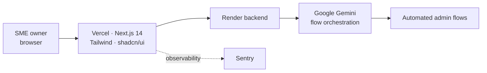

# SincroAI — No-Code AI for SME Operations
> Cuts the manual admin work out of running a small business — with flows a non-technical owner can build.

<!-- HERO -->

<i>🎬 Hero image / demo GIF coming soon — building an automated admin flow, no code.</i>

## The problem

SMEs across LATAM lose hours to manual administrative work — the kind that's repetitive, error-prone and doesn't need a human, but also doesn't justify a developer. SincroAI hands that work to **No-Code flows an owner can assemble themselves**, orchestrated by an LLM.

## What it does

A **No-Code AI assistant** for administrative optimization of SMEs (Chile, Mexico, Colombia, Peru). The owner describes what they need; **Google Gemini** orchestrates the flow; the platform runs it. The target is a **≥40% reduction in manual administrative work**. Shipped as an MVP with real deployment infrastructure — frontend on Vercel, backend on Render, monitoring via Sentry.

## Architecture

## Results & impact

- Target **≥40% reduction** in manual administrative work
- Shipped as **MVP v0.1.0** with full deploy pipeline (Vercel · Render · Sentry)
- Aimed at SMEs across four LATAM markets

## Stack

Next.js 14 (App Router) · Tailwind · shadcn/ui · Google Gemini · Render · Vercel · Sentry

## Source & access

Private (product IP). Happy to walk through the architecture or grant **read-only access on request**.
Live demo: [sincro-ai.vercel.app](https://sincro-ai.vercel.app).

**Contact:** [Portfolio](https://cs-portfolio-psi-topaz.vercel.app) · [LinkedIn](https://www.linkedin.com/in/akhan-espinoza) · castrolorenzosegundo@gmail.com
